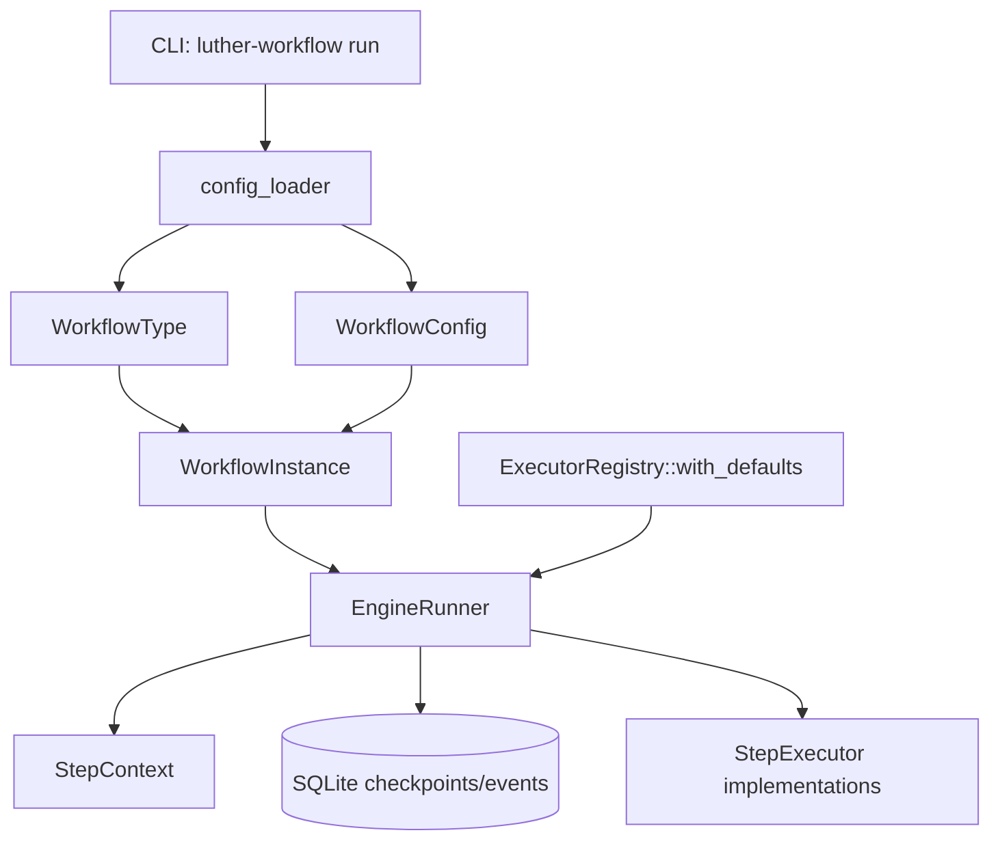
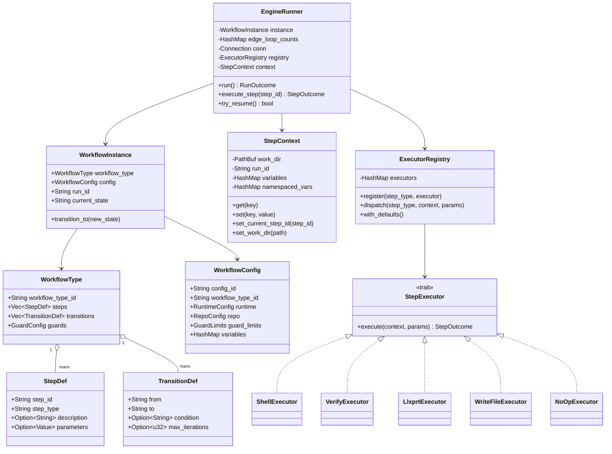
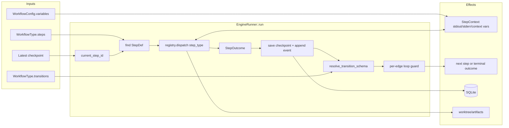

# Luther Engine Walkthrough

This document explains the current Luther workflow engine as implemented in this repository. It is intentionally written as an operator/developer walkthrough, not as an aspirational design. It links to the actual Rust files that matter and calls out the parts that are still rough.

## Entry points and source map

| Area | File |
| --- | --- |
| CLI run command wiring | [`src/main.rs`](../src/main.rs) |
| Workflow/config schema | [`src/workflow/schema.rs`](../src/workflow/schema.rs) |
| Config loading/validation | [`src/workflow/config_loader.rs`](../src/workflow/config_loader.rs) |
| Runtime instance | [`src/engine/instance.rs`](../src/engine/instance.rs) |
| Main execution loop | [`src/engine/runner.rs`](../src/engine/runner.rs) |
| Step outcomes/transitions | [`src/engine/transition.rs`](../src/engine/transition.rs) |
| Execution context and registry | [`src/engine/executor.rs`](../src/engine/executor.rs) |
| Concrete executors | [`src/engine/executors/`](../src/engine/executors/) |
| Checkpoints/events persistence | [`src/persistence/checkpoint.rs`](../src/persistence/checkpoint.rs) |
| Run metadata persistence | [`src/persistence/run_metadata.rs`](../src/persistence/run_metadata.rs) |

The engine is a sequential state machine over a declarative workflow graph. `EngineRunner` ([`src/engine/runner.rs`](../src/engine/runner.rs)) is the single supported runtime: a durable, resumable, outcome-routed state machine backed by SQLite checkpointing. It is intentionally not built on a static DAG executor (such as `dagrs`), whose parallel task-graph model does not match Luther's dynamic, resumable, transition-driven execution.

## Conceptual model

A Luther run binds two TOML/JSON documents:

1. A **workflow type**: the step graph (`[[steps]]` and `[[transitions]]`).
2. A **workflow config**: runtime limits, repository config, and variable values.

The CLI loads both, creates a [`WorkflowInstance`](../src/engine/instance.rs), attaches the default [`ExecutorRegistry`](../src/engine/executor.rs), then calls [`EngineRunner::run`](../src/engine/runner.rs).



## Class diagram



## Butterfly diagram: how a step becomes the next step

The engine is shaped like a butterfly around `EngineRunner::run`: configuration and context flow into a step on the left; an executor outcome and transition resolution fan back out on the right.



A single iteration does this:

1. Set `current_step_id` in [`StepContext`](../src/engine/executor.rs).
2. Find the matching [`StepDef`](../src/workflow/schema.rs) by `step_id`.
3. Dispatch `step_type` to a registered executor.
4. Executor returns a [`StepOutcome`](../src/engine/transition.rs): `success`, `fixable`, `fatal`, `retryable`, or `abandon`.
5. Runner saves a checkpoint and event.
6. Runner finds a matching transition from the current step and outcome.
7. If the transition loops backward, runner enforces the edge's `max_iterations` or the global guard limit.
8. Runner moves `WorkflowInstance.current_state` to the next step or returns a terminal [`RunOutcome`](../src/engine/runner.rs).

## Step outcomes and transitions

Outcomes live in [`src/engine/transition.rs`](../src/engine/transition.rs):

| Outcome | Meaning in current engine |
| --- | --- |
| `success` | Normal successful step. If a transition has no `condition`, it is treated as the success edge. |
| `fixable` | The step failed in a way the workflow can remediate if a `condition = "fixable"` edge exists. |
| `fatal` | A system/nonrecoverable failure. The Luther workflow routes these to `abandon_and_log`. |
| `retryable` | Defined, but not meaningfully used by the current Luther workflow. |
| `abandon` | Terminal abandonment from executor output. |

Transition lookup is simple: scan the configured transitions in order, pick the first transition where `from` matches and either `condition` matches the outcome string or `condition` is absent and the outcome is `success`.

Loop protection is per edge. A backward edge such as `evaluate_impl -> implement` has its own counter (`evaluate_impl:implement`). The runner decides that an edge is a loop if the destination step appears at the same or an earlier position in the `steps` array. That means step ordering in the TOML matters for loop detection.

## Execution context and interpolation

[`StepContext`](../src/engine/executor.rs) is the key-value bus between steps and executors.

Important behaviors:

- Built-ins: `work_dir` and `run_id` exist from run start.
- Config variables from `[variables]` are loaded at runner construction.
- Every step sets `current_step_id` before execution.
- `context.set("foo", "bar")` writes both a flat variable and a namespaced variable under the current step.
- Interpolation replaces placeholders like `{work_dir}`, `{issue_number}`, or `{fetch_issue.issue_title}` in command/prompt templates.
- Bare key lookup searches most-recent step namespaces first, then the `config` namespace, then flat variables.

This enables workflows like:

```toml
command = "gh issue view {issue_number} --repo {target_repo}"
```

where `issue_number` was extracted by an earlier shell step and `target_repo` came from the workflow config.

## Executor registry and executors

[`ExecutorRegistry::with_defaults`](../src/engine/executor.rs) currently registers:

| `step_type` | Executor | File | What it does |
| --- | --- | --- | --- |
| `shell` | `ShellExecutor` | [`shell.rs`](../src/engine/executors/shell.rs) | Runs `sh -c`, supports interpolation, stdin, JSON extraction, stdout markers, exit-code mapping, and optional timeout. |
| `verify` | `VerifyExecutor` | [`verify.rs`](../src/engine/executors/verify.rs) | Runs configured project checks, writes `verify-report.json`, returns `success` or `fixable`. |
| `llxprt` | `LlxprtExecutor` | [`llxprt.rs`](../src/engine/executors/llxprt.rs) | Invokes the LLxprt CLI noninteractively, detects marker strings, can write deterministic static outputs, and can stop on success files/diffs. |
| `write_file` | `WriteFileExecutor` | [`write_file.rs`](../src/engine/executors/write_file.rs) | Writes interpolated content to files. |
| `noop` | `NoOpExecutor` | [`noop.rs`](../src/engine/executors/noop.rs) | Test/simple placeholder. |

### ShellExecutor

[`ShellExecutor`](../src/engine/executors/shell.rs) is the basic bridge to tools like `git`, `gh`, `jq`, and `npm`.

Notable features:

- Runs in `StepContext.work_dir()`.
- Interpolates `command`, `stdin`, and related parameters.
- Supports `output_format = "json"` plus `context_map` to extract values into context.
- Supports `outcome_on_stdout` for marker-based routing.
- Supports `exit_code_map`; otherwise non-zero exits become `fixable`.
- Supports `timeout_seconds`, returning `fatal` with exit code `124` on timeout.

### VerifyExecutor

[`VerifyExecutor`](../src/engine/executors/verify.rs) runs a sequence such as `lint`, `typecheck`, `test`, `format`, `build`. Standard commands are currently npm scripts:

- `lint` -> `npm run lint 2>&1`
- `typecheck` -> `npm run typecheck 2>&1`
- `test` -> `npm run test 2>&1`
- `format` -> `npm run format:check 2>&1`
- `build` -> `npm run build 2>&1`

The workflow can override commands with `check_commands`, choose specific `checks`, set `timeout_seconds`, and set `artifact_root`.

The executor writes `verify-report.json` to either `{artifact_root}` or `.luther` under the worktree. It caps raw stdout/stderr at 20,000 bytes to keep remediation prompts usable.

Timeout behavior is deliberately conservative: on Unix it starts a new process group and tries to terminate the group on timeout. Current tests pass, but local test output can still show `kill: -PID: Operation not permitted`; see caveats below.

### LlxprtExecutor

[`LlxprtExecutor`](../src/engine/executors/llxprt.rs) is the autonomous-agent bridge. It runs:

```text
llxprt --set reasoning.includeInResponse=false --profile-load <profile> --yolo -p <prompt>
```

Important behavior:

- Uses `-p`; plain stdin with `--yolo` enters interactive mode and can hang.
- Captures stdout/stderr incrementally in reader threads.
- Polls stdout for configured `outcome_on_stdout` markers while the process is still running.
- Supports `success_file` and `success_on_diff` success conditions.
- Supports `static_content` + `success_file`, used when we want deterministic output without spawning LLxprt.
- Supports `static_stdout`, used when an evaluation should deterministically emit a marker such as `PLAN_APPROVED`.
- On timeout, returns `fatal` and sets `exit_code = 124`.

## Persistence model

The runner writes state through [`persistence/checkpoint.rs`](../src/persistence/checkpoint.rs):

- `checkpoints`: latest saved step state, retry count, loop counts, context snapshot placeholder, status, timestamp.
- `events`: append-only per-step outcome records.

Run metadata is written through [`persistence/run_metadata.rs`](../src/persistence/run_metadata.rs) at terminal completion.

Current limitation: checkpoints carry loop counters but do not persist the full `StepContext` variable map. Resume support is therefore partial: it can resume step position and counters, but not reconstruct all step-produced context values.

## What might you not like about the engine implementation so far?

1. **It is sequential and graph-simple.** `parallel_steps` exists in config schema, but the runner executes one step at a time.
2. **It is a custom state machine, not a generic DAG runtime.** `EngineRunner` is purpose-built Rust loop code chosen for durable, resumable, outcome-routed execution rather than a static DAG library such as `dagrs`.
3. **Loop detection depends on step ordering.** A loop is detected when the destination step appears earlier or equal in the `steps` array. That is simple, but brittle if someone reorders steps for readability.
4. **`retryable` is underused.** The outcome exists, but the current main workflow relies mostly on `success`, `fixable`, and `fatal`.
5. **Context persistence is incomplete.** Checkpoints persist counters and status, not the full context bus. Robust resume after process death is not complete.
6. **LLxprt process cleanup is weaker than verifier cleanup.** `LlxprtExecutor` currently kills the direct child only; if the agent spawns descendants, cleanup may be incomplete.
7. **Timeout/process-group behavior is Unix-biased.** Verify timeout cleanup uses Unix process groups. Non-Unix behavior is not equivalent.
8. **Some implementation comments are stale.** For example, descriptions can still say full deterministic checks are run even when a docs-only smoke workflow currently narrows checks to `format`.
9. **Config and prompts carry policy.** A lot of important behavior is in TOML prompt text rather than typed Rust code, which is flexible but easy to drift.
10. **Validation is shallow.** The loader validates basics, but it does not prove every transition destination exists, every variable will be present, every step type is registered, or every prompt writes required files.
11. **Failure semantics can be surprising.** A shell non-zero exit defaults to `fixable` unless mapped; the workflow author must remember to map system failures to `fatal`.
12. **Run metadata/checkpoint database is not yet a full product surface.** It is enough for tests and basic state, but not yet a rich operations dashboard.

## Mental model to keep

Think of Luther's engine as:

> A TOML-driven, single-threaded state machine with a mutable context map and pluggable step executors.

The engine is not the intelligence. The intelligence is mostly in the workflow graph, prompt text, and external tools (`llxprt`, `gh`, `git`, `npm`). The Rust engine provides the guardrails: dispatch, interpolation, transition routing, loop caps, checkpoints, and structured verification reports.
