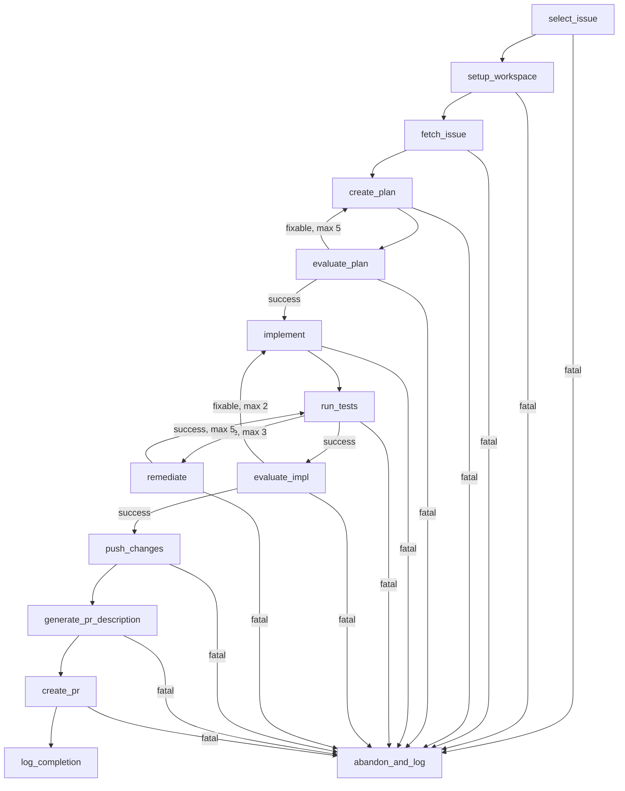

# Luther Issue-Fix Workflow Walkthrough

This document walks through the current Luther workflow used to process issues in `vybestack/llxprt-code`. It focuses on the real configuration and process currently in this repo.

The main files are:

| Purpose | File |
| --- | --- |
| Workflow graph and step definitions | [`config/workflows/llxprt-issue-fix-v1.toml`](../config/workflows/llxprt-issue-fix-v1.toml) |
| Target-repo runtime config | [`config/workflow-configs/llxprt-code.toml`](../config/workflow-configs/llxprt-code.toml) |
| Workflow schema | [`src/workflow/schema.rs`](../src/workflow/schema.rs) |
| Config loader | [`src/workflow/config_loader.rs`](../src/workflow/config_loader.rs) |
| Engine runner | [`src/engine/runner.rs`](../src/engine/runner.rs) |
| Shell executor | [`src/engine/executors/shell.rs`](../src/engine/executors/shell.rs) |
| LLxprt executor | [`src/engine/executors/llxprt.rs`](../src/engine/executors/llxprt.rs) |
| Verify executor | [`src/engine/executors/verify.rs`](../src/engine/executors/verify.rs) |
| Fixture mirror | [`tests/fixtures/workflows/valid/llxprt-issue-fix-v1.toml`](../tests/fixtures/workflows/valid/llxprt-issue-fix-v1.toml) |

## How to run the workflow

The smoke runs used this shape:

```bash
cargo build --release
./target/release/luther-workflow run --config-dir config -w llxprt-issue-fix-v1 -c llxprt-code
```

The CLI path is in [`src/main.rs`](../src/main.rs): it loads workflow type `llxprt-issue-fix-v1`, loads config `llxprt-code`, creates a `WorkflowInstance`, builds the default executor registry, and calls `EngineRunner::run()`.

## Configuration split

Luther intentionally splits **what to do** from **where/how to do it**.

### Workflow type: graph and steps

[`config/workflows/llxprt-issue-fix-v1.toml`](../config/workflows/llxprt-issue-fix-v1.toml) defines:

- `workflow_type_id = "llxprt-issue-fix-v1"`
- `[[steps]]`: ordered steps with `step_id`, `step_type`, description, and executor parameters.
- `[[transitions]]`: graph edges between steps, optionally conditioned on `success`, `fixable`, or `fatal`.
- `max_iterations` on selected loop-back edges.

### Workflow config: target repo and profiles

[`config/workflow-configs/llxprt-code.toml`](../config/workflow-configs/llxprt-code.toml) defines:

- `config_id = "llxprt-code"`
- `workflow_type_id = "llxprt-issue-fix-v1"`
- runtime limits such as `timeout_seconds` and `max_retries`
- repository defaults like `base_branch = "main"`
- variables injected into the workflow context:
  - `target_repo = "vybestack/llxprt-code"`
  - `work_dir = "/tmp/luther-workspaces/llxprt-code"`
  - `artifact_dir = "/tmp/luther-artifacts/llxprt-code"`
  - `luther_label = "Luther working"`
  - `ok_label = "OK for Luther"`
  - `profile_planning`, `profile_evaluating`, `profile_implementing`, `profile_remediating`

Current smoke-test caveat: this config also has `primary_issue_number = "1808"`, which forces issue #1808 before the normal queue selection path. That is useful for smoke testing but should be removed or generalized before unattended queue runs.

## Process diagram



The important design change from the smoke work is that deterministic verification now happens before subjective implementation review:

```text
implement -> run_tests -> evaluate_impl -> push_changes
```

That means build/test/format failures go into the remediation loop instead of being re-litigated by a subjective reviewer.

## Step-by-step walkthrough

### 1. `select_issue`

Source: [`llxprt-issue-fix-v1.toml`](../config/workflows/llxprt-issue-fix-v1.toml), step `select_issue`.

Executor: `shell` via [`ShellExecutor`](../src/engine/executors/shell.rs).

What it does:

1. If `{primary_issue_number}` is set and not `0`, it tries that issue first.
2. It requires the issue to be open, unassigned, labeled exactly `{ok_label}` (`OK for Luther`), and not labeled `{luther_label}` (`Luther working`).
3. Otherwise it scans milestones in semver order, finds open unassigned issues with `OK for Luther`, excludes already-working issues, and skips issues that already have open PRs.
4. It claims the selected issue by assigning `{assignee}` and adding `Luther working`.
5. It emits JSON `{number, title}`.

The JSON is parsed by `ShellExecutor` using:

```toml
output_format = "json"
[steps.parameters.context_map]
issue_number = ".number"
issue_title = ".title"
```

Those values become `{issue_number}` and `{issue_title}` for later steps.

### 2. `setup_workspace`

Executor: `shell`.

What it does:

1. Clones `https://github.com/{target_repo}.git` into `{work_dir}` if needed.
2. Fetches origin.
3. Checks out and hard-resets `{base_branch}`.
4. Creates branch `issue{issue_number}`.
5. Runs `npm ci --ignore-scripts` only if `node_modules` is missing.
6. Creates `{artifact_dir}`.
7. Deletes stale plan/evaluation/remediation artifacts.

The `--ignore-scripts` choice was introduced during smoke testing because target-repo lifecycle scripts were spawning costly build/test work before Luther reached implementation.

### 3. `fetch_issue`

Executor: `shell`.

What it does:

- Writes full GitHub issue JSON to `{artifact_dir}/issue-raw.json`.
- Writes issue body to `{artifact_dir}/issue.md`.
- Writes comments to `{artifact_dir}/comments.md`.
- Emits issue title/url JSON back to context.

Artifacts are deliberately outside the target repo so Luther does not accidentally commit `.luther` or scratch files.

### 4. `create_plan`

Executor: `llxprt` via [`LlxprtExecutor`](../src/engine/executors/llxprt.rs).

Current smoke-test behavior is deterministic:

```toml
success_file = "{artifact_dir}/plan.md"
static_content = """
# Implementation Plan
...
"""
```

Because `static_content` is set, the executor writes `{artifact_dir}/plan.md` directly and returns `success` without spawning LLxprt.

This was done for the #1808 docs-only smoke test after plan generation/evaluation proved to be a source of agent hangs and variance. It is not a general planning solution yet.

### 5. `evaluate_plan`

Executor: `llxprt`.

Current behavior is also deterministic:

```toml
static_stdout = "PLAN_APPROVED"
[steps.parameters.outcome_on_stdout]
PLAN_APPROVED = "success"
PLAN_NEEDS_REVISION = "fixable"
```

So this step returns `success` without a model call. If made non-static later, the intended behavior is to review `issue.md` and `plan.md`, then emit either `PLAN_APPROVED` or `PLAN_NEEDS_REVISION`.

### 6. `implement`

Executor: `llxprt`.

This is where the target repo fix happens. For the #1808 smoke run, LLxprt edited the target repo documentation and eventually printed:

```text
IMPLEMENTATION_COMPLETE
```

The workflow maps that marker to `success`:

```toml
outcome_on_stdout = { IMPLEMENTATION_COMPLETE = "success", IMPLEMENTATION_SYSTEM_ERROR = "fatal" }
```

The current prompt is very narrow because #1808 is docs-only:

- edit only `docs/cli/skills.md`
- do not modify source, lockfiles, generated notices, or unrelated files
- do not run full project verification; the workflow handles verification after implementation
- if previous subjective feedback exists, treat it as a checklist

### 7. `run_tests`

Executor: `verify` via [`VerifyExecutor`](../src/engine/executors/verify.rs).

Current docs-only smoke config:

```toml
checks = ["format"]
timeout_seconds = 240
artifact_root = "{artifact_dir}"
```

That means the verifier runs only the standard `format` command:

```bash
npm run format:check 2>&1
```

and writes:

```text
{artifact_dir}/verify-report.json
```

If checks pass, outcome is `success` and the workflow goes to `evaluate_impl`. If checks fail or timeout, outcome is `fixable` and the workflow goes to `remediate`.

Important caveat: the generic `VerifyExecutor` still supports `lint`, `typecheck`, `test`, `format`, and `build`; the workflow is currently narrowed to `format` because #1808 is docs-only and full-repo verification was too costly/noisy during smoke testing.

### 8. `remediate`

Executor: `llxprt`.

This step reads `{artifact_dir}/verify-report.json` and tries to fix current-branch verification failures only. It maps:

```toml
REMEDIATION_COMPLETE = "success"
REMEDIATION_SYSTEM_ERROR = "fatal"
```

A successful remediation loops back to `run_tests`. The workflow has two loop caps in this area:

- `run_tests -> remediate`: max 3
- `remediate -> run_tests`: max 5

### 9. `evaluate_impl`

Executor: `llxprt`.

This is the subjective review step. It runs only after deterministic verification passes. The prompt instructs the reviewer to judge whether the implementation materially solves the issue and follows the plan, not to re-check formatting/test style.

Outcomes:

- `IMPL_APPROVED` -> `success` -> `push_changes`
- `IMPL_NEEDS_WORK` -> `fixable` -> `implement` with max 2 loop-backs

For #1808, this distinction mattered because a reviewer can confuse interactive `/skills` behavior with terminal `llxprt skills` behavior. The prompt now explicitly asks it to distinguish those.

### 10. `push_changes`

Executor: `shell`.

What it does:

1. Restores `packages/vscode-ide-companion/NOTICES.txt` if dirty.
2. Stages all changes except `.luther/**` and that generated notice file.
3. Fails if there are no staged changes.
4. Commits with:

   ```text
   Fix #{issue_number}: {issue_title}
   ```

5. Pushes branch `issue{issue_number}`.

This exclusion exists because target smoke runs repeatedly showed CRLF/stat noise in `packages/vscode-ide-companion/NOTICES.txt` that should not be part of docs-only PRs.

### 11. `generate_pr_description`

Executor: `llxprt`.

This step writes `{artifact_dir}/pr-description.md`. It must include:

```text
Fixes #{issue_number}
```

so GitHub auto-closes the issue when the PR merges.

### 12. `create_pr`

Executor: `shell`.

Runs:

```bash
gh pr create --repo {target_repo} \
  --title "Fix #{issue_number}: {issue_title}" \
  --body-file {artifact_dir}/pr-description.md \
  --base {base_branch} \
  --head issue{issue_number}
```

PR titles include the issue number, satisfying the local project rule.

### 13. `log_completion`

Executor: `shell`.

Prints a success message. No further automation happens inside the workflow after PR creation.

### 14. `abandon_and_log`

Executor: `shell`.

Fatal transitions route here. It comments on the issue, removes the `Luther working` label, and unassigns the issue. It also has guard clauses for cases where issue selection failed and `{issue_number}` was never populated.

## Butterfly diagram: issue lifecycle

```mermaid
flowchart LR
    subgraph Intake[Intake and claim]
        Eligible[OK for Luther label]
        Select[select_issue]
        Claim[assign + Luther working]
    end

    subgraph Work[Worktree and artifacts]
        Setup[setup_workspace]
        Fetch[fetch_issue]
        Artifacts[(artifact_dir)]
        Branch[issue branch]
    end

    subgraph Agent[Agent work]
        Plan[create_plan]
        PlanEval[evaluate_plan]
        Impl[implement]
        Subjective[evaluate_impl]
    end

    subgraph Deterministic[Deterministic gate]
        Verify[run_tests / VerifyExecutor]
        Report[verify-report.json]
        Remediate[remediate]
    end

    subgraph Publish[Publish]
        Commit[push_changes]
        PRDesc[generate_pr_description]
        PR[create_pr]
    end

    Eligible --> Select --> Claim --> Setup --> Branch --> Fetch --> Artifacts
    Artifacts --> Plan --> PlanEval --> Impl --> Verify
    Verify -- pass --> Subjective --> Commit --> PRDesc --> PR
    Verify -- fixable --> Report --> Remediate --> Verify
    Subjective -- needs work --> Impl
```



## What happened in the successful #1808 smoke run

The successful run selected forced issue #1808, created branch `issue1808`, made a docs-only edit, ran format verification, approved the implementation, committed, pushed, generated a PR description, and created PR #1909.

Target commit:

```text
d1a907194 Fix #1808: Document actual default scope behavior for /skills enable and disable
```

PR:

```text
https://github.com/vybestack/llxprt-code/pull/1909
```

After the workflow created the PR, operator follow-up still happened outside the engine:

- `gh pr checks 1909 --watch --interval 300`
- CodeRabbit review inspection
- comment explaining why one CodeRabbit issue was invalid
- resolve the CodeRabbit thread
- confirm checks green

That PR follow-up is required project policy, but it is not yet fully automated inside this workflow.

## What might you not like about the workflow implementation so far?

1. **The current config is smoke-test-specific.** `primary_issue_number = "1808"` forces one issue. Good for proving the loop; bad for unattended queue processing.
2. **Planning/evaluation are partly hard-coded.** `create_plan` uses `static_content` and `evaluate_plan` uses `static_stdout`. That made the #1808 smoke reliable, but it is not a general autonomous planning pipeline.
3. **Verification is narrowed to docs-only format.** The generic verifier can run lint/typecheck/test/format/build, but this workflow currently runs only `format`. That was appropriate for a docs-only smoke, but it is too weak for code changes.
4. **The workflow is highly prompt-driven.** Critical behavior lives in prompt text. This is flexible but brittle: small wording changes can alter model behavior.
5. **No typed issue classification.** The workflow does not yet automatically classify docs-only vs code-change issues and choose verification scope accordingly.
6. **No built-in PR aftercare.** CI watching and CodeRabbit handling were done by the operator after PR creation. The workflow stops at `create_pr`/`log_completion`.
7. **Target-repo setup is simplistic.** It uses one worktree path and `npm ci --ignore-scripts` only if `node_modules` is absent. There is no robust dependency cache, lock validation strategy, or per-run isolated clone yet.
8. **Git staging is still broad.** `git add -A` with exclusions worked for #1808, but a safer approach would stage only allowed paths derived from the plan/issue type.
9. **Issue selection policy is embedded in shell.** The `gh`/`jq` selection logic is powerful but not type-safe, not unit-tested as Rust, and could break with GitHub CLI/API behavior changes.
10. **Failure cleanup is GitHub-side only.** `abandon_and_log` comments/unlabels/unassigns, but it does not archive detailed run artifacts to a durable external place or open a Luther engine issue.
11. **No cost/token/file-change enforcement yet.** Guard limits are present in config, but the current engine does not enforce all of them.
12. **Workflow fixture mirroring is manual.** TOML changes must be mirrored/regenerated into test fixtures with `junk/regen_fixtures.py`; there is no first-class checked-in command for this yet.
13. **The prompt says all deterministic checks passed even when only format ran.** The `evaluate_impl` description/prompt still references lint/typecheck/test/build conceptually, but the current docs-only workflow only runs `format`. That wording should be made conditional or accurate before broader use.
14. **The normal queue has not been proven after the forced issue override.** The successful smoke proves the engine can process one chosen docs issue, not that autonomous queue selection is production-ready.

## Suggested next hardening steps

1. Remove or generalize `primary_issue_number`.
2. Add an explicit issue-type/profile decision step: docs-only, test-only, small code, refactor, unsafe/skip.
3. Make verification scope a typed output of that decision step rather than hard-coding `checks = ["format"]`.
4. Move GitHub issue selection logic from shell into a Rust executor or a well-tested script.
5. Persist full step context in checkpoints to make resume real.
6. Automate PR aftercare: check watching, CodeRabbit review thread handling, and CI failure remediation.
7. Replace broad staging with allowlisted paths where possible.
8. Create a first-class fixture regeneration command under `xtask` instead of ad hoc `junk/regen_fixtures.py`.

## Mental model to keep

Think of `llxprt-issue-fix-v1.toml` as the product's behavior and the Rust engine as its interpreter.

The workflow currently says:

> Pick an explicitly-approved issue, prepare a target branch, collect issue context, use LLxprt to make a constrained change, verify it, ask LLxprt to review subjective correctness, commit/push, and open a PR.

The #1808 smoke proves that this loop can work for a narrow docs-only case. It does not yet prove broad autonomous coding across arbitrary issues.
